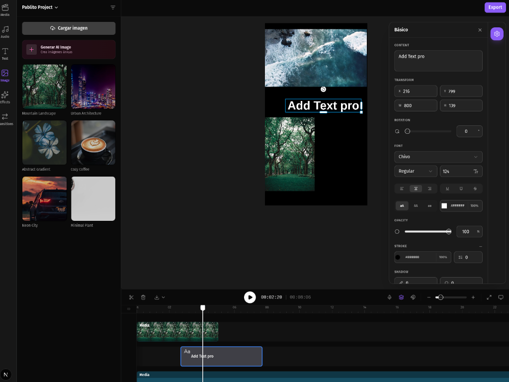

# Pablito Silva Inca - CV Website



A premium, modern, and high-performance CV website built with Next.js 15+, Tailwind CSS 4, and Shadcn UI. This project serves as a comprehensive portfolio showcasing engineering expertise across cybersecurity and full-stack development.

## 🚀 Features

- **Next Video Editor V2**: A high-performance web-based video editor powered by `openvideo` and `Fabric.js`.
- **AI-Powered Experiences**: Integration with Google Gemini AI for advanced content generation and chat interactions.
- **Full Localization (I18n)**: Seamless English and Spanish support implemented through a centralized, type-safe translation system.
- **GitHub Integration**: Real-time contribution calendar and repository stats using the GitHub API.
- **Cybersecurity Profile**: Showcases expert background in EDR (Cortex XDR) and systems hardening.
- **Modern UI/UX**: Professional design featuring glassmorphism, fluid animations (Framer Motion), and responsive layouts.
- **Modular Architecture**: Clean, scalable code structure with reusable UI components and logic-focused contexts.
- **High Performance**: Optimized with Next.js Turbopack and Tailwind CSS 4 for a blazing-fast user experience.

## 🛠️ Tech Stack

- **Framework**: [Next.js 15+](https://nextjs.org/) (App Router, Turbopack)
- **AI/ML**: [AI SDK (Google Gemini)](https://sdk.vercel.ai/) & [@google/genai](https://www.npmjs.com/package/@google/genai)
- **Video Processing**: [openvideo](https://www.designcombo.io/) & [Fabric.js](http://fabricjs.com/)
- **Styling**: [Tailwind CSS 4](https://tailwindcss.com/) & [Shadcn UI](https://ui.shadcn.com/)
- **State Management**: [Zustand](https://zustand-demo.pmnd.rs/)
- **Animation**: [Framer Motion](https://www.framer.com/motion/) & [tw-animate-css](https://www.npmjs.com/package/tw-animate-css)
- **Icons**: [Lucide React](https://lucide.dev/) & [Tabler Icons](https://tabler-icons.io/)
- **Infrastructure**: [Google Cloud Platform](https://cloud.google.com/)

## 📦 Getting Started

1. **Clone the repository**:

   ```bash
   git clone git@github.com:Pablituuu/profile.git
   ```

2. **Install dependencies**:

   ```bash
   npm install
   ```

3. **Configure Environment Variables**:
   Create a `.env` file (see `.env.example` if available):

   ```env
   NEXT_PUBLIC_GITHUB_USERNAME=your_username
   # Add AI/Cloud keys as needed
   ```

4. **Run development server**:
   ```bash
   npm run dev
   ```

## 👤 Contact & Socials

- **Full Name**: Pablito Jean Pool Silva Inca
- **Location**: Huancayo, Perú
- **Email**: [pablito.silvainca@gmail.com](mailto:pablito.silvainca@gmail.com)
- **Phone**: [+51 922323921](tel:+51922323921)
- **LinkedIn**: [Pablito Silva Inca](https://www.linkedin.com/in/pablito-jean-pool-silva-inca-735a03192/)
- **GitHub**: [@pablituuu](https://github.com/pablituuu)

## 📄 License

This project is licensed under the MIT License.
